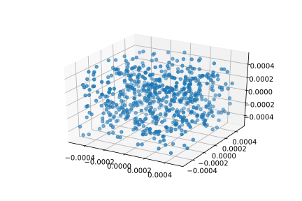
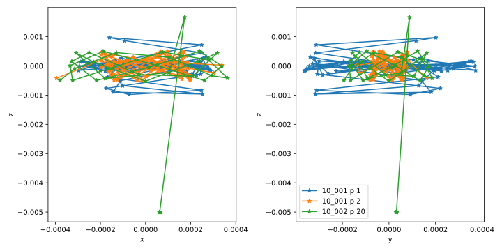
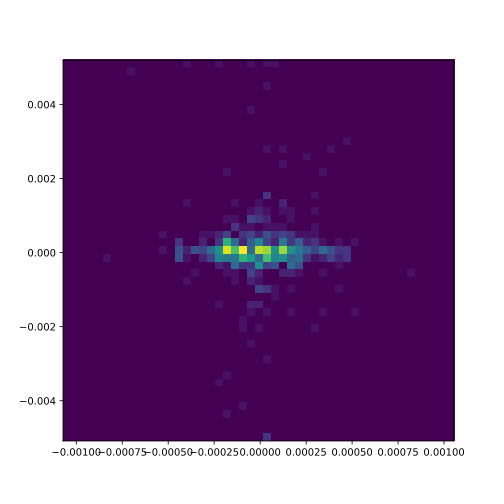
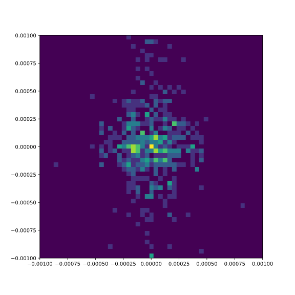

.. _usersguide-visualization:

========================================
Visualization of IDSimF ion trajectories
========================================

IDSimPy provides functionality to plot and animate particle trajectory data from IDSimF results. Visualizing results is often key for the understanding of simulation results, and is thus an important aspect of IDSimPy. 

Custom plotting with matplotlib
===============================

Since the data structures in :py:class:`.Trajectory` objects are comparably simple, it is easy to do custom plotting of particle simulation result data with visualization libraries, e.g. matplotlib. For example, particle positions can be easily depicted in a scatter plot with matplotlib: 

.. code-block:: python 

    import os
    import numpy as np
    import matplotlib.pyplot as plt
    import IDSimPy.analysis.trajectory as tr

    # open a (in this case legacy) hdf5 trajectory file:
    hdf5_file = os.path.join('test','analysis','data', 'qitSim_2019_04_scanningTrapTest',
                                        'qitSim_2019_04_10_001_trajectories.hd5')

    tra = tr.read_legacy_hdf5_trajectory_file(hdf5_file)

    # extract positions of first recorded time step: 
    ts = traj_hdf5.get_positions(0)

    # create a 3d scatter plot of the particle positions in the first time step: 
    x,y,z = ts[:,0],ts[:,1],ts[:,2]

    fig = plt.figure()
    ax = fig.add_subplot(111, projection='3d')
    ax.scatter(x,y,z)

This yields something like 

Particle trace plots
====================

The traces of individual particles can be plotted in a flexible way with :py:func:`.plot_particle_traces`. This function can plot individual particle traces from different trajectories in one figure, which allows the direct comparison of different particles. 

The function renders the plot as PDF and takes the name of the result PDF file as first argument. The second argument, ``particle_definitions``, defines the particles to plot. It is a tuple of tuples, which each define the particles to plot for a :py:class:`.Trajectory` object. Each of those configuration lines consist of a :py:class:`.Trajectory`, a list of particle indices to plot, and a legend label for the series of particles defined by the line. 

For example 

.. code-block:: python 

    particle_definition = [
        (tra_1, (1, 2), "10_001"),
        (tra_2, 20, "10_002"),
    ]

in the following example, defines the particles 1 and 2 from trajectory :py:data:`tra_1` with the label ``10_001`` and particle 20 from trajectory :py:data:`tra_2` with the label ``10_002``:

.. code-block:: python 

    import os
    import IDSimPy.analysis.trajectory as tr
    import IDSimPy.analysis.visualization as vis

    # Read two (legacy) HDF5 trajectory files from the test files
    dat_path = os.path.join('..','test','analysis','data','qitSim_2019_04_scanningTrapTest')
    tra_1 = tr.read_legacy_hdf5_trajectory_file(os.path.join(dat_path,'qitSim_2019_04_10_001_trajectories.hd5'))
    tra_2 = tr.read_legacy_hdf5_trajectory_file(os.path.join(dat_path,'qitSim_2019_04_10_002_trajectories.hd5'))

    # Define parameters for plot
    result_name = 'test_particle_plotting_01'
    particle_definition = [
        (tra_1, (1, 2), "10_001"),
        (tra_2, 20, "10_002"),
    ]

    # Plot
    vis.plot_particle_traces(result_name, particle_definition)

The example yields something like 

Particle scatter plots and animations
=====================================

Scatter plots draw individual symbols for the simulated particles in a particle ensemble. Usually, the spatial position of the particle symbols in the coordinate system of the plot reflect the spatial position of the simulated particles. There are also different variants of this plot type, where the velocity of the simulated particles becomes a spatial dimension in the plot (phase space plots). 

There is a high level plot function, which allows to generate generic scatter plot animations quickly and comparably conveniently. The high level functions are wrapper functions around the actual scatter plot rendering functions. The wrapper functions open the trajectory, generate the scatter animation and writes it to a video file. The actual scatter plot rendering functions can also be used directly, e.g. if the resulting scatter animation should be processed further or reading a trajectory multiple times is inefficient. 

High level scatter plot animation function
------------------------------------------

:py:func:`.render_scatter_animation` provides a simple function to render scatter animations in an xy and xz projection. It takes the name of a simulation *project* as first argument, opens the trajectory file of that project and renders an animation into a mp4 file given as second argument. For example, specifying ``my_simulation`` as output name in an IDSimF solver will usually generate a trajectory file ``my_simulation_trajectories.hd5`` which can be animated by calling :py:func:`.render_scatter_animation` with ``my_simulation`` as first argument. 

A minimal example of a scatter plot an IDSimF simulation result would be

.. code-block:: python 

    import os
    import IDSimPy.analysis.visualization as vis

    data_base_path = os.path.join('..','test','analysis','data')
    project_name = os.path.join(
        data_base_path, 
        'qitSim_2019_07_variableTrajectoryQIT', 
        'qitSim_2019_07_22_001')

    result_name = os.path.join('scatter_animation_simple')

    vis.render_scatter_animation(project_name, result_name)

This example yields an animation similar to: 

.. raw:: html

    <video width="650" height="350" controls>
        <source src="../_static/scatter_animation_simple_scatter.mp4" type="video/mp4">
        Your browser does not support the video tag.
    </video>

Parameters like spatial limits of the plotted region and the transparency of the particle symbols (alpha value) can be set easily by optional arguments to :py:func:`.render_scatter_animation`: 

.. code-block:: python 

    import os
    import IDSimPy.analysis.visualization as vis

    data_base_path = os.path.join('..','test','analysis','data')
    project_name = os.path.join(
        data_base_path, 
        'qitSim_2019_07_variableTrajectoryQIT', 
        'qitSim_2019_07_22_001')

    result_name = os.path.join('scatter_animation_custom_limits')

    vis.render_scatter_animation(project_name, result_name, xlim=(-5e-3, 5e-3), ylim=(-8e-4, 8e-4), alpha=0.9)

.. raw:: html

    <video width="650" height="350" controls>
        <source src="../_static/scatter_animation_custom_limits_scatter.mp4" type="video/mp4">
        Your browser does not support the video tag.
    </video>

Using colorization in scatter plots
...................................

The color of the rendered particle symbols can be used to display additional information, which is typically contained in particle attributes. If a name of a particle attribute is specified in the :py:data:`color_parameter` argument, this particle attribute is used for colorization, as shown in the following example: 

.. code-block:: python 

    import os
    import IDSimPy.analysis.visualization as vis

    # define project and file names
    data_base_path = os.path.join('test','analysis','data')
    project_name = os.path.join(
        data_base_path, 
        'reactive_IMS', 
        'IMS_HS_reactive_test_001')

    result_name = os.path.join('chemical_id_colorized')

    # render scatter animation with 'chemical_id' as colorization parameter and 'Set1' as colormap: 
    vis.render_scatter_animation(project_name, result_name, 
                                xlim=(0, 5e-3), ylim=(-8e-4, 16e-4), 
                                alpha=0.8, 
                                color_parameter='chemical_id', 
                                cmap='Set1')

The example yields an animation similar to: 

.. raw:: html

    <video width="650" height="350" controls>
        <source src="../_static/chemical_id_colorized_scatter.mp4" type="video/mp4">
        Your browser does not support the video tag.
    </video>

The chemical identity of the particles are discernible and it becomes visible, that the particles begin to separate. 

It is possible to use a fully custom colorization for static trajectories: The :py:data:`color_parameter` argument in :py:func:`.render_scatter_animation` can also be a vector of custom numeric values, one per simulated particle, which is then used for colorization. The next example in the next section shows this with the low level scatter plot function. 

Low level scatter plot functions
--------------------------------

Technical, the "high level" plot function is a wrapper function around the actual scatter plot rendering functions :py:func:`.animate_scatter_plot` and :py:func:`.animate_variable_scatter_plot`. Both functions take a :py:class:`.Trajectory` object and a set of rendering / style options and generate an animation object. The function :py:func:`.animate_scatter_plot` generates scatter plots from static trajectories, while :py:func:`.animate_variable_scatter_plot` generates scatter plots from variable trajectory objects. The resulting animation objects can be saved to a video file, as shown in the following example: 

.. code-block:: python 

    import os
    import numpy as np
    import IDSimPy.analysis.trajectory as tr
    import IDSimPy.analysis.visualization as vis

    # prepare filenames and read trajectory: 
    data_base_path = os.path.join('test','analysis','data')
    trajectory_file_name = os.path.join(
        data_base_path, 
        'reactive_IMS', 
        'IMS_HS_reactive_test_001_trajectories.hd5')

    tra = tr.read_hdf5_trajectory_file(trajectory_file_name)

    result_name = os.path.join('scatter_plot_colorized.mp4')

    # use start x position for colorization: 
    c_param = tra.get_positions(0)[:,0]

    # generate scatter plot and save to mp4 file:
    anim = vis.animate_scatter_plot(tra,
                                    xlim=(0, 5e-3), ylim=(-8e-4, 16e-4), 
                                    alpha=0.8, 
                                    color_parameter=c_param, 
                                    cmap='plasma')

    anim.save(result_name, fps=20, extra_args=['-vcodec', 'libx264'])

The example yields an animation similar to: 

.. raw:: html

    <video width="650" height="350" controls>
        <source src="../_static/scatter_plot_colorized.mp4" type="video/mp4">
        Your browser does not support the video tag.
    </video>

The colorization makes the axial diffusion of the particles discernible. 

Particle density plots and animations
=====================================

--------------------
Simple density plots
--------------------

A density plot shows the density of simulated particles in the cells of a grid across a spatial domain. This allows to understand the spatially resolved particle density in the region of interest, even when the individual symbols rendered by scatter plots are not providing any useful information anymore, e.g. due to very high numbers of simulated particles. 

The function :py:func:`.plot_density_xz` provides a density plot of the particle density in a projection on a xz plane: 

.. code-block:: python 

    import IDSimPy.analysis.visualization as vis

    # tra is an imported Trajectory object
    ts_index = 50
    vis.plot_density_xz(tra, ts_index, axis_equal=False);

yields for example 

The figure size and the bins of the grid can be customized: 

.. code-block:: python 

    import numpy as np
    import IDSimPy.analysis.visualization as vis

    # the visualization lib can generate density plots: 
    ts_index = 50
    vis.plot_density_xz(tra_1, ts_index,
                    xedges=np.linspace(-0.001, 0.001, 50),
                    zedges=np.linspace(-0.001, 0.001, 50),
                    figsize=(8,8),
                    axis_equal=True);
    
yields for example 

---------------------------
Particle density animations
---------------------------

Animated visualizations often show the underlying dynamics in a particle ensemble much better than static plots. IDSimPy can render animated density plots. 

High level density animation function
-------------------------------------

Similarly to the scatter plot functionality, there is a high level and a more low level function to render density animations. :py:func:`.render_xz_density_animation` is a high level animation plot function which gives a quick way to look into the dynamics of an IDSimF result. 

Similarly to :py:func:`.render_scatter_animation`, the function takes the name of a simulation *project* as first argument, opens the trajectory file of that project and renders an animation into a mp4 file given as second argument. For example, specifying ``my_simulation`` as output name in an IDSimF solver will usually generate a trajectory file ``my_simulation_trajectories.hd5`` which can be animated by calling :py:func:`.render_xz_density_animation` with ``my_simulation`` as first argument. 

Similarly to :py:func:`.plot_density_xz`, additional parameters like the edges of the bins of the grid used for the local summation of particles can be changed: 

.. code-block:: python 

    data_base_path = os.path.join('test', 'analysis', 'data')
    project_name = os.path.join(data_base_path, 'qitSim_2019_04_scanningTrapTest', 'qitSim_2019_04_15_001')

    result_name = 'density_animation'

    vis.render_xz_density_animation(
        project_name, result_name, 
        xedges=100,
        zedges=np.linspace(-0.004, 0.004, 100),
        axis_equal=False, file_type='legacy_hdf5')

The edges of the bin grid (:py:data:`xedges`, :py:data:`zedges`) can be set directly as array as presented in the example for :py:data:`zedges`. If a integer value is given as argument for the edges, the full extend of the particle positions in the spatial direction is segmented into the specified number of equidistant bins. 

The example yields an animation similar to 

.. raw:: html

    <video width="400" height="400" controls>
        <source src="../_static/density_animation_densityXZ.mp4" type="video/mp4">
        Your browser does not support the video tag.
    </video>

Low level density animation function
------------------------------------

Besides the high level function described above, there is also a low level function :py:func:`.animate_xz_density`, which is in fact used by the high level function for creating the animation. The low level function takes a trajectory object and return an animation object, which then can be processed further, e.g. saved to a video file: 

.. code-block:: python 

    # open trajectory: 
    data_base_path = os.path.join('..', 'test', 'analysis', 'data')
    trj_name = os.path.join(data_base_path, 'qitSim_2019_04_scanningTrapTest', 'qitSim_2019_04_15_001_trajectories.hd5')
    tra = tr.read_legacy_hdf5_trajectory_file(trj_name)

    # generate animation object:
    anim = vis.animate_xz_density(
        tra,
        xedges=np.linspace(-0.001, 0.001, 50),
        zedges=np.linspace(-0.001, 0.001, 50),
        figsize=(10, 5))

    # save animation to a video file: 
    result_name = os.path.join('density_animation_test_1.mp4')
    anim.save(result_name, fps=20, extra_args=['-vcodec', 'libx264'])

This example yields an animation similar to 

.. raw:: html

    <video width="400" height="400" controls>
        <source src="../_static/density_animation_densityXZ_lowlevel.mp4" type="video/mp4">
        Your browser does not support the video tag.
    </video>

Note that the low level function is also capable to export single frames as images. 

Comparative density animations
------------------------------

It is often useful to directly compare ions from different simulation runs or different ion groups in one simulation run. :py:func:`.render_xz_density_comparison_animation` allows to render such comparative density animations.

Comparing ion density from two trajectories
...........................................

As the following example shows, :py:func:`.render_xz_density_comparison_animation` takes two simulation project names, selectors which ions to render in each trajectory and has a bunch of optional arguments which control the animation rendering: 

.. code-block:: python 

    import os
    import IDSimPy.analysis.visualization as vis

    # prepare two project names and result file name
    dat_path = os.path.join('..','test','analysis','data','qitSim_2019_07_variableTrajectoryQIT')
    pro_1_name = os.path.join(dat_path,'qitSim_2019_07_22_001')
    pro_2_name = os.path.join(dat_path,'qitSim_2019_07_22_002')
    project_names = [pro_1_name, pro_2_name]
    result_name = 'comparative_density_animation'

    # Render comparative density plot with all particles from both simulation projects rendered
    vis.render_xz_density_comparison_animation(
        project_names, ['all', 'all'], result_name, n_frames=50, interval=1, s_lim=5e-3, n_bins=[100, 100],
        select_mode=None, annotation="", mode="log", file_type='hdf5')

This example generates an animation similar to 

.. raw:: html

    <video width="400" height="400" controls>
        <source src="../_static/density_animation_densitiesComparisonXZ.mp4" type="video/mp4">
        Your browser does not support the video tag.
    </video>

The difference between the simulation runs becomes obvious by this visualization method. 

Comparing density of two ion groups within the same trajectory
..............................................................

:py:func:`.render_xz_density_comparison_animation` is also often used to compare ion groups within the same trajectory. The following examples shows how to compare two groups of ions specified by their chemical ids: 

.. code-block:: python 

    import os
    import IDSimPy.analysis.visualization as vis

    reactive_ims_project_name = os.path.join(
			'test', 'analysis', 'data', 'reactive_IMS', 'IMS_HS_reactive_test_001')

    project_names = [reactive_ims_project_name, reactive_ims_project_name]
    chem_ids = [0, 1]
    result_name = 'reactive_ims_1'

    vis.render_xz_density_comparison_animation(
        project_names, chem_ids, result_name, n_frames=30, interval=1,
        select_mode='substance', s_lim=[0, 5e-3, -1e-3, 2e-3], n_bins=[150, 40],
        annotation="", mode="log", file_type='hdf5')

It yields an animation similar to 

.. raw:: html

    <video width="500" height="300" controls>
        <source src="../_static/density_animation_ims_densitiesComparisonXZ.mp4" type="video/mp4">
        Your browser does not support the video tag.
    </video>

The chemical reaction dynamics in the particle ensemble is clearly observable. 

